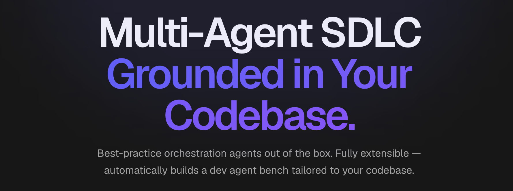

# ClosedLoop.AI Claude Plugins

<div>
  
  
  
</div>

<br/>



ClosedLoop is an AI platform that brings the speed of individual AI-driven development to the full software development team. We're offering our agents as open sourced Claude Code plugins because we just couldn't keep this a secret for ourselves — check out our agents for planning, code reviews, judging quality and more that outperform Opus 4.6 and Sonnet 4.5 out of the box.

**Bootstrap. Plan. Code. Ship.** It's that simple.

LLMs are great at non-deterministic content generation — horrible at being repeatably correct.

That's why we took Claude Code and extended it with a lightweight multi-agent orchestration workflow paradigm that works for us; modeling how we collaborate as a team.

Optimized for efficiency & correctness to produce code that lands without the churn; it's grounded in your codebase and outperforms Opus 4.6 out of the box at half the cost.

What's more impactful is that it allowed our team of engineers to shift left; reviewing and approving sprints-worth of work scope in documented implementation plans and generating the code while we slept.

Tickets become Tasks. Epics become Features. Sections of your quarterly roadmap land in a few PRs.

Multi-repository, adaptive self-learning, & artifact-bound phased workflow gates that loop until correct.

**Close the Loop on your SDLC with the same tools that made us 400% faster today.**

## Plugins

| Plugin | Description |
|--------|-------------|
| [**bootstrap**](plugins/bootstrap/) | Project bootstrapping and initial setup |
| [**code**](plugins/code/) | Code generation, implementation planning, and iterative development loop |
| [**code-review**](plugins/code-review/) | Automated code review with inline GitHub PR comments |
| [**judges**](plugins/judges/) | LLM-as-judge evaluators for plan and code quality |
| [**platform**](plugins/platform/) | Claude Code expert guidance, prompt engineering, and artifact management |
| [**self-learning**](plugins/self-learning/) | Pattern capture and organizational knowledge sharing |

## Prerequisites

- Python 3.11+ (3.13 recommended)
- [jq](https://jqlang.github.io/jq/)
- [Claude Code](https://claude.ai/code)

## Quick Start

**One-line install** — installs the five Symphony runtime plugins at user scope and keeps them auto-updated:

```bash
curl -fsSL https://raw.githubusercontent.com/closedloop-ai/claude-plugins/main/install.sh | bash
```

The installer installs `code`, `code-review`, `judges`, `platform`, and `self-learning`, then verifies those runtime plugins are present with existing install paths and enabled user-scoped entries. It re-enables disabled user-scoped runtime plugins and attempts to remove stale project-scoped duplicates when Claude reports a usable `projectPath`. If Claude reports a project-scoped entry without a usable project path, the installer prints the project-directory uninstall command and still repairs the user-scoped install. The `bootstrap` plugin remains available in the marketplace for manual installation, but it is not part of the default runtime install.

Or install interactively from within Claude Code:

```bash
claude /plugin marketplace install closedloop
```

Then start using the plugins:

```bash
# Plan. Code.
claude /code:code --prd requirements.md

# Review.
claude /code-review:start
```

## Codex Marketplace

This repository uses a unified plugin layout: each root `plugins/<plugin>`
directory contains the Claude Code source artifacts and the generated Codex
plugin artifacts side by side.

```text
plugins/code/
├── .claude-plugin/plugin.json   # Claude Code manifest
├── .codex-plugin/plugin.json    # Codex manifest
├── agents/ commands/ skills/    # Claude Code source of truth
├── .codex/                      # Generated Codex agents/config
├── .agents/                     # Generated Codex skills
└── AGENTS.md                    # Generated Codex instructions
```

The Codex artifacts were generated from the Claude Code plugins with
[`@disdjj/acplugin`](https://github.com/closedloop-ai/acplugin). To regenerate
them, write the conversion output to a temporary directory first, then copy the
Codex-only artifacts into each plugin directory:

```bash
for p in bootstrap code code-review judges platform self-learning; do
  npx @disdjj/acplugin convert "plugins/$p" --to codex -o "/tmp/closedloop-codex/$p"
  cp -R "/tmp/closedloop-codex/$p/.codex-plugin" "plugins/$p/"
  cp -R "/tmp/closedloop-codex/$p/.agents" "plugins/$p/"
  [ -d "/tmp/closedloop-codex/$p/.codex" ] && cp -R "/tmp/closedloop-codex/$p/.codex" "plugins/$p/"
  [ -f "/tmp/closedloop-codex/$p/AGENTS.md" ] && cp "/tmp/closedloop-codex/$p/AGENTS.md" "plugins/$p/"
done
```

`codex-marketplace` installs from GitHub tree URLs. Use slash-free branch names
for developer validation because branch names containing `/` can be mis-parsed
as part of the tree path.

Install from the current developer branch:

```bash
npx codex-marketplace add https://github.com/closedloop-ai/claude-plugins/tree/codex-marketplace-unified/plugins --plugins --project
```

Install from `main` after the implementation has been reviewed and merged:

```bash
npx codex-marketplace add https://github.com/closedloop-ai/claude-plugins/tree/main/plugins --plugins --project
```

Use `--global` instead of `--project` when installing into your user profile
rather than a consuming project.

<details>
<summary><strong>Development setup</strong></summary>

```bash
git clone git@github.com:closedloop-ai/claude-plugins.git
cd claude-plugins
git config core.hooksPath .githooks
```

</details>

## Benchmarks


## Contributing

See [CONTRIBUTING.md](CONTRIBUTING.md) for development setup, workflow, and code style guidelines.

## Disclaimer
Our claude code plugins are a low-key engineering preview of the agents that run the larger ClosedLoop platform. These agents should be used for testing in trusted environments.

## License

[Apache License 2.0](LICENSE)
