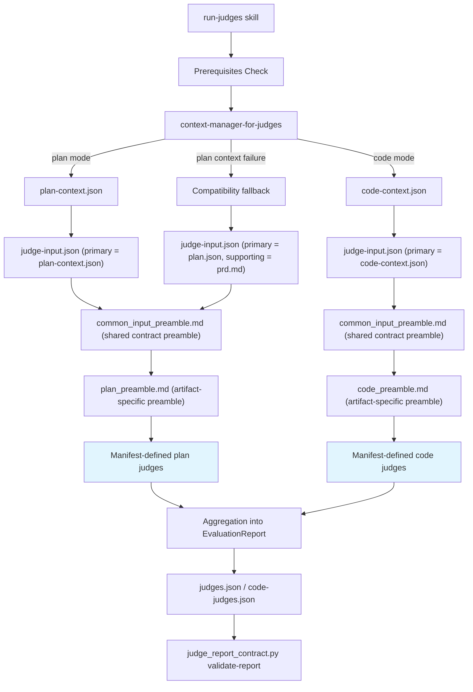

# judges

A collection of specialized LLM judge agents that evaluate implementation plans and code artifacts against software engineering principles and best practices. Judges run in parallel, score artifacts using a structured `CaseScore` JSON schema, and aggregate results into a validation report.

## Features

- **Plan and code evaluation modes** with mode-specific judge sets defined in `agents/judge-manifest.json`
- **Parallel judge execution** with deterministic aggregation
- **Structured output** using a validated `CaseScore` JSON schema with strict dataclass-based validation
- **Artifact compression** to keep large artifacts within token budgets before judge invocation
- **Generic context contract** via `$CLOSEDLOOP_WORKDIR/judge-input.json` so judges evaluate task+context passed by orchestrator
- **SSOT input-contract preamble injection** via shared `common_input_preamble.md` (applied to every judge) plus artifact-specific preambles (`plan_preamble.md` / `code_preamble.md`)
- **Investigation context reuse** in both plan and code modes via `$CLOSEDLOOP_WORKDIR/investigation-log.md` when available (embedded in context bundles by default)
- **Resilient preflight fallback**: in plan mode, probe `@code:pre-explorer`, then run internal best-effort investigation if unavailable; in code mode, attempt best-effort pre-explorer generation and continue non-blocking if unavailable
- **Evaluation caching** to skip redundant plan evaluations when the plan has not changed
- **Performance telemetry** written to `perf.jsonl` for each pipeline phase

## Architecture Overview



The `run-judges` skill short-circuits plan evaluation when `plan-evaluation.json` is newer than `plan.json`, avoiding redundant judge runs.

The `artifact-type-tailored-context` skill compresses individual artifact files within a token budget using tiered summarization (full content, intelligent compression, or hard truncation) before passing them to judges.

## Support Agents

### context-manager-for-judges

**Purpose:** Prepares compressed context bundles for both plan and code judge evaluation before judges run.

**Model:** sonnet

**Responsibilities:**
- Collect plan/code evaluation artifacts from `$CLOSEDLOOP_WORKDIR`
- Allocate and enforce a 30,000-token budget across artifacts
- Invoke `judges:artifact-type-tailored-context` per artifact
- Write `plan-context.json` or `code-context.json` with compaction metadata

### code-quality-judge

**Purpose:** Evaluates overall code quality by combining goal alignment, technical accuracy, test quality, and code organization criteria into a single comprehensive assessment.

**Model:** sonnet

**Used in:** code and plan evaluation (see `agents/judge-manifest.json`)

### design-principles-judge

**Purpose:** Evaluates implementation plans for DRY, KISS, and SSOT design principle violations in a single pass.

**Model:** sonnet

**Used in:** code evaluation (see `agents/judge-manifest.json`)

### plan-evaluation-judge

**Purpose:** Evaluates implementation plans across readability and verbosity calibration.

**Model:** sonnet

**Used in:** plan evaluation (see `agents/judge-manifest.json`)

### solid-principles-judge

**Purpose:** Evaluates code implementation adherence to SOLID principles covering Interface Segregation, Dependency Inversion, Open/Closed, and Liskov Substitution in a single comprehensive pass.

**Model:** sonnet

**Used in:** code evaluation (see `agents/judge-manifest.json`)

## Judge Input and Output Contracts

All judge runs are contract-driven: orchestrators assemble `judge-input.json`, judges emit `CaseScore`, and `run-judges` aggregates those results into a validated report.

### Input: `judge-input.json`

Path: `$CLOSEDLOOP_WORKDIR/judge-input.json`

This envelope is the canonical input contract consumed by all judges. It decouples judges from hardcoded file names and allows orchestrators to map artifacts explicitly per run.
At runtime, this contract guidance is injected from `common_input_preamble.md`, which is prepended to every judge prompt before invocation; judge agent prompt files intentionally avoid duplicating input-contract boilerplate.

**Required top-level fields:**

| Field | Type | Description |
|-------|------|-------------|
| `evaluation_type` | string | Evaluation mode (`plan` or `code`) |
| `task` | string | Natural-language objective judges must evaluate against |
| `primary_artifact` | object | Authoritative evidence artifact descriptor |
| `supporting_artifacts` | array | Secondary evidence artifact descriptors in priority order |
| `source_of_truth` | array | Ordered artifact IDs defining evidence priority |
| `fallback_mode` | object | Fallback activation + reason + mapped fallback artifacts |
| `metadata` | object | Run metadata (`run_id` required; `generated_at` optional) |

**Artifact descriptor shape** (used by `primary_artifact` and `supporting_artifacts[]`):

```json
{
  "id": "plan_context",
  "path": "/abs/or/workdir-relative/path",
  "type": "json",
  "required": true,
  "description": "Compressed plan context bundle"
}
```

**Behavior rules:**
- Judges read `judge-input.json` first, then resolve mapped artifacts.
- `primary_artifact` is authoritative; supporting artifacts provide secondary context.
- Legacy filename assumptions are allowed only when `fallback_mode.active = true` and fallback artifacts are explicitly declared.
- The schema for this envelope is defined in `schemas/judge-input.schema.json`.

### Shared preamble behavior

All judges receive the same shared preamble from `skills/run-judges/preambles/common_input_preamble.md` before any artifact-specific preamble is appended.

That shared preamble standardizes:
- required read order (`judge-input.json` first, then mapped artifacts)
- source-of-truth priority (`task`, `primary_artifact`, then `supporting_artifacts`)
- fallback semantics (`fallback_mode.active` must gate legacy assumptions)
- error handling contract (return `CaseScore` with `final_status = 3` on input-contract failures)

### Output: `CaseScore`

Each judge returns one `CaseScore` JSON object:
- `type`: `"case_score"`
- `case_id`: judge identifier
- `final_status`: `1` (pass), `2` (fail/conditional pass), or `3` (error)
- `metrics`: scored dimensions with `metric_name`, `threshold`, `score`, and `justification`

### Aggregated output report

`run-judges` wraps all `CaseScore` entries into:
- `$CLOSEDLOOP_WORKDIR/judges.json` for plan evaluation
- `$CLOSEDLOOP_WORKDIR/code-judges.json` for code evaluation

The report is validated after generation using `skills/run-judges/scripts/judge_report_contract.py` (`validate-report` subcommand).

## Skills

### run-judges

Orchestrates parallel judge agent execution, aggregates `CaseScore` results, and validates output.

**Parameters:**
- `--artifact-type`: `plan` (default) or `code`

**Plan mode** (default):
- Launches `context-manager-for-judges` to produce `plan-context.json`
- Builds `judge-input.json` with task, source-of-truth ordering, and mapped artifacts
- Uses envelope mapping (not hardcoded filenames) for plan-judge input
- Reuses `$CLOSEDLOOP_WORKDIR/investigation-log.md` as supporting context when present
- If `investigation-log.md` is missing: probes `@code:pre-explorer`; if unavailable/failing, generates a lightweight internal investigation log
- If plan context generation fails: uses one emergency compatibility fallback to `plan.json` + `prd.md` for that run
- Prepends `common_input_preamble.md` + `plan_preamble.md` to each judge prompt
- Loads plan judge routing from `agents/judge-manifest.json` (`categories.plan`)
- Writes manifest-defined output file (default: `$CLOSEDLOOP_WORKDIR/judges.json`)

**Code mode** (`--artifact-type code`):
- Launches `context-manager-for-judges` agent to produce `code-context.json`
- Builds `judge-input.json` with code evaluation task and artifact mapping
- Reuses `$CLOSEDLOOP_WORKDIR/investigation-log.md` during context preparation; investigation evidence is embedded in `code-context.json` by default to avoid duplicate standalone mapping
- Prepends `common_input_preamble.md` + `code_preamble.md` to each judge prompt
- Loads code judge routing from `agents/judge-manifest.json` (`categories.code`)
- Writes manifest-defined output file (default: `$CLOSEDLOOP_WORKDIR/code-judges.json`)

**Output validation** is run after writing the report using `skills/run-judges/scripts/judge_report_contract.py` (`validate-report` subcommand). The skill retries until validation passes.

---

### artifact-type-tailored-context

Compresses individual artifact files within a token budget before judge invocation. Runs in a forked context to avoid polluting the parent agent's context window.

**Parameters:** `artifact_path`, `task_description`, `token_budget`

**Compression tiers:**
1. **Full content** — artifact fits within budget; returned unchanged
2. **Intelligent compression** — artifact is 1x–1.5x the budget; applies artifact-type-specific summarization (code diffs preserve function signatures, JSON arrays are truncated, log files keep errors/warnings, plan markdown keeps headings and code blocks)
3. **Hard truncation** — artifact exceeds 1.5x the budget; truncated at paragraph boundary with a `[TRUNCATED]` marker

**Returns:** JSON with `artifact_name`, `raw_tokens`, `compacted_tokens`, `truncated`, and `content`.

---

## Usage

### Evaluating an Implementation Plan

1. Ensure `$CLOSEDLOOP_WORKDIR/prd.md` and `$CLOSEDLOOP_WORKDIR/plan.json` exist.
2. Optional but preferred: include `$CLOSEDLOOP_WORKDIR/investigation-log.md` (the skill can generate it via fallback if missing).
3. Invoke the `run-judges` skill (default artifact type is `plan`):

```
@judges:run-judges
```

4. The skill runs `context-manager-for-judges` to create `plan-context.json`, then builds `judge-input.json` for judges.
5. If plan context generation fails, one-run compatibility fallback uses `plan.json` + `prd.md`.
6. Results are written to `$CLOSEDLOOP_WORKDIR/judges.json`.

### Evaluating Implemented Code

1. Ensure code artifacts (git diff, changed files, build results) are available in `$CLOSEDLOOP_WORKDIR`.
2. Invoke the `run-judges` skill with the code artifact type:

```
@judges:run-judges --artifact-type code
```

3. The skill resolves `investigation-log.md` as best-effort context input (reuse if present; attempt generation when missing; continue if unavailable).
4. The skill runs `context-manager-for-judges` first to produce `code-context.json`, then builds `judge-input.json` with `code-context.json` as primary evidence (avoid separate `investigation-log.md` mapping unless context manager explicitly skipped it) and launches manifest-configured code judges.
5. Results are written to the manifest-defined output file (default: `$CLOSEDLOOP_WORKDIR/code-judges.json`).

### Updating Judge Selection

To add, remove, or reorder judges, edit `agents/judge-manifest.json`.

`run-judges` and `judge_report_contract.py` both load this manifest at runtime. If the manifest is missing or invalid, execution fails fast.

### Output Format

Each judge produces a `CaseScore`:

```json
{
  "type": "case_score",
  "case_id": "design-principles-judge",
  "final_status": 1,
  "metrics": [
    {
      "metric_name": "dry_score",
      "threshold": 0.8,
      "score": 0.9,
      "justification": "No duplication detected. T-2.1 creates a shared auth utility used by T-3.1, T-3.2, and T-3.3."
    }
  ]
}
```

The aggregated report (`judges.json` or `code-judges.json`) wraps all `CaseScore` objects:

```json
{
  "report_id": "{RUN_ID}-judges",
  "timestamp": "2024-02-03T15:45:30Z",
  "stats": [ ... ]
}
```
