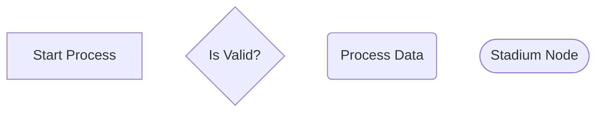
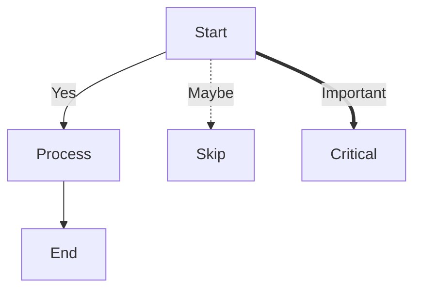
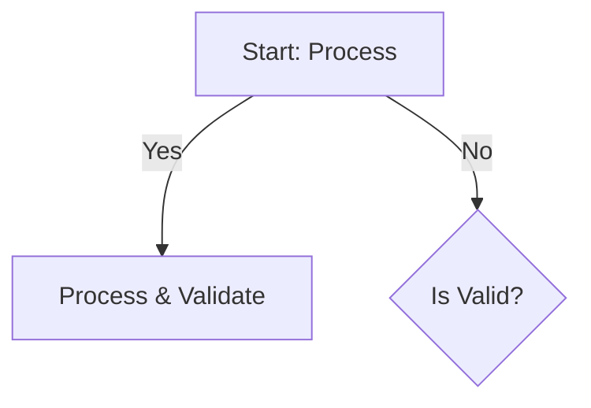
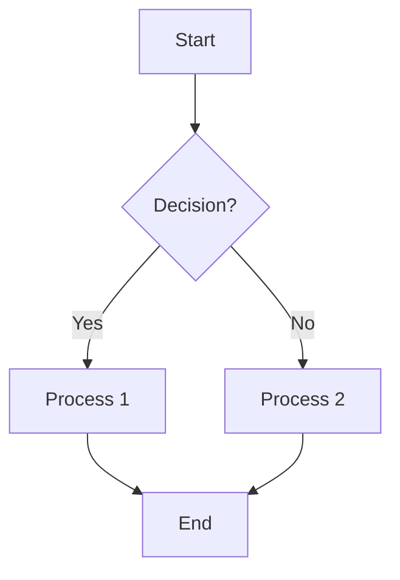
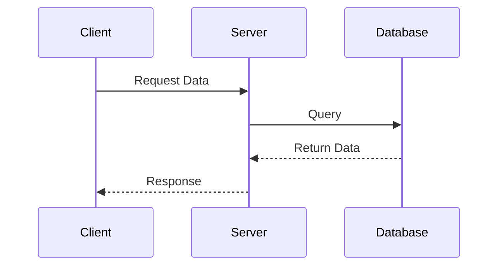
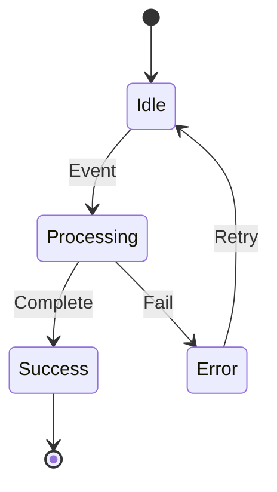
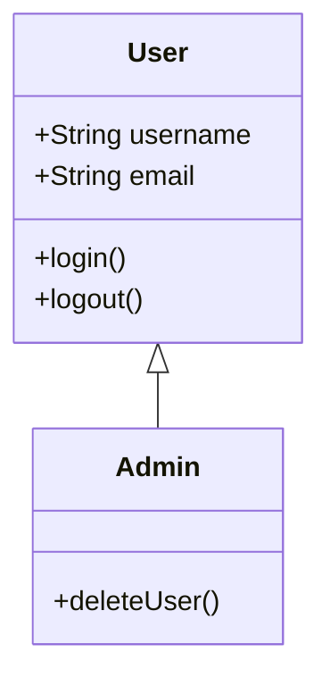

# Mermaid Diagram Syntax Reference

## Node Syntax: `NodeID[Display Label]`

**Structure**: `NodeID[Display Label]`

- **NodeID**: The internal identifier used to reference the node in connections (e.g., `A`, `StartNode`, `Process1`)
  - Must be a valid identifier (alphanumeric, underscores allowed)
  - Used when creating connections: `NodeID --> OtherNode`
- **Display Label**: The text shown inside the node shape (e.g., `[Start]`, `[Process Data]`)
  - Enclosed in square brackets `[]` for rectangular nodes
  - Enclosed in curly braces `{}` for diamond/decision nodes
  - Enclosed in parentheses `()` for rounded nodes
  - Enclosed in `([ ])` for stadium-shaped nodes

**Examples**:

## Edge Syntax: `Node1 --> |Label| Node2`

**Structure**: `SourceNode --> |Edge Label| TargetNode`

- **`-->`**: Arrow connector (right arrow)
  - `-->` : Solid arrow
  - `-.->` : Dotted arrow
  - `==>` : Thick arrow
  - `--` : Line without arrow
- **`|Label|`**: Optional edge label displayed along the connection
  - Enclosed in pipe characters `|Label Text|`
  - Appears centered on the edge
  - Used to describe conditions, actions, or relationships

**Examples**:

## Prohibited Symbols in Labels and Names

### In Node IDs (identifiers):
- **Quotes** (`"` or `'`): Break parsing - Mermaid interprets them as string delimiters
- **Square brackets** `[]`: Reserved for label delimiters
- **Curly braces** `{}`: Reserved for decision node shapes
- **Parentheses** `()`: Reserved for rounded node shapes
- **Pipes** `|`: Reserved for edge labels
- **Arrows** `-->`, `<--`, etc.: Reserved for connections
- **Colons** `:`: Can cause parsing issues in some contexts
- **Semicolons** `;`: Used as statement terminators
- **Commas** `,`: Used to separate multiple connections

### In Display Labels:
- **Unescaped quotes**: Can break parsing if not properly escaped
- **Unescaped pipes** `|`: Conflict with edge label syntax
- **Unescaped brackets**: Can confuse the parser about node boundaries

### Why These Restrictions Exist:
- **Parsing Ambiguity**: Mermaid uses these symbols as syntax delimiters. Using them in content would make it impossible to distinguish between syntax and content.
- **Parser Limitations**: The Mermaid parser is context-sensitive and relies on specific character sequences to identify different diagram elements.
- **Rendering Conflicts**: Some characters have special meaning in the rendering engine and could cause visual artifacts.

### Safe Alternatives:
- Use **underscores** `_` or **hyphens** `-` instead of spaces in node IDs
- Use **quoted strings** for labels with special characters: `NodeID["Label with: special chars"]`
- Escape special characters when necessary
- Use **HTML entities** for symbols: `&lt;`, `&gt;`, `&amp;`, etc.

**Example with Safe Labeling**:

## Common Diagram Types

### Flowcharts

### Sequence Diagrams

### State Diagrams

### Class Diagrams

## Best Practices

1. **Keep diagrams simple and focused** on the main concept
2. **Use consistent naming conventions** throughout the diagram
3. **Add descriptive labels** to nodes and edges to explain relationships
4. **Use colors strategically** to highlight important elements or categories
5. **Include a legend** if using multiple colors, shapes, or symbol meanings
6. **Break complex diagrams** into smaller, more manageable ones for clarity
7. **Validate syntax** by checking for proper node ID format and connection syntax
8. **Test rendering** to ensure the diagram displays as intended
9. **Avoid deep nesting** - Keep the visual hierarchy clear and understandable
10. **Label decision points clearly** - Use descriptive text on edges from decision nodes
